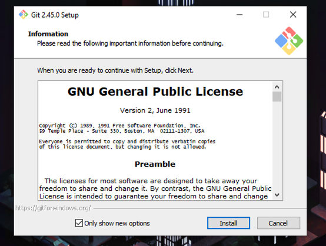

# GitManual
WindowsにGitをインストールしてVSCODEでgithubに資料やコードをCommit(アップロード）するまでのチュートリアル

## 本セクションの目的

githubに資料やコードをアップロード(コミット)しておいておくためには、ローカル(任意の手持ちのパソコン)からリモート(github)に変更という流れで作業をする必要がある。そのために必要なプログラムがGitであり、これをインストールすることで、ローカルの変更をリモートに反映させるなどの処理ができるようになる。本セクションでは、これらの処理を行えるようになるまでのセットアップおよび基本操作について解説する。この時、vscodeから直接コミットをはじめgit関連の処理が行えるため、vscodeとgitの組み合わせを前提とする。

# VSCODEのインストール

[VSCODEのインストール方法](https://github.com/SK-Lab-HU/PythonSetupManual)

# Gitのインストール

1. Gitダウンロードページにアクセスする。([Download git](https://git-scm.com/download/win))

2. 2つ目の64-bit Git for Windows Setupを選択する。

3. ダウンロードが完了したら、インストーラーを開く。この時、以下のような画面が出た場合は、Yesを選択する。

4. Installを押す。

