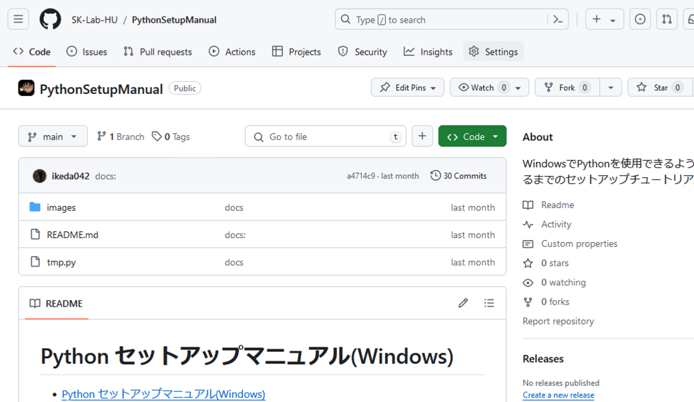

# GitManual
WindowsにGitをインストールしてVSCODEでgithubに資料やコードをCommit(アップロード）するまでのチュートリアル

## 本セクションの目的

githubに資料やコードをアップロード(コミット)しておいておくためには、ローカル(任意の手持ちのパソコン)からリモート(github)に変更という流れで作業をする必要がある。そのために必要なプログラムがGitであり、これをインストールすることで、ローカルの変更をリモートに反映させるなどの処理ができるようになる。本セクションでは、これらの処理を行えるようになるまでのセットアップおよび基本操作について解説する。この時、vscodeから直接コミットをはじめgit関連の処理が行えるため、vscodeとgitの組み合わせを前提とする。


# VSCODEのインストール

[VSCODEのインストール方法](https://github.com/SK-Lab-HU/PythonSetupManual)

# Gitのインストール

1. Gitダウンロードページにアクセスする。([Download git](https://git-scm.com/download/win))

2. <b>64-bit Git for Windows Setup</b>を選択する。


3. ダウンロードが完了したら、インストーラーを開く。この時、以下のような画面が出た場合は、Yesを選択する。


4. Installを押す。


5. このあとは、複数回様々なオプションについてダイアログが出てくるが、すべてポジティブなものを選択していく。最終的に以下の画面が表示されれば、Gitのインストールは終了。


6. コマンドプロンプトを開いて、以下コマンドを実行して、gitのバージョンが出てきたらインストールは成功している。

```Bash
git -v
```


# VSCODEでgitを使用する

上記のgitインストールが正常に完了している場合、VSCODEを開いた際にClone Git Repositoryという項目が増えている。


ここで、Cloneはリモート(github上)のリポジトリをローカル(自分のPC)に文字通りクローンするという意味である。

## Cloneの例

試しに、以下リポジトリのクローンを行う。

[Python設定マニュアルのリポジトリ](https://github.com/SK-Lab-HU/PythonSetupManual)

1. 上記のページの中で、緑色のCodeボタンを選択する。



2. HTTPSセクションを開いて、コピーアイコンをクリックまたは、URLを直接コピーする。

この場合なら、

https://github.com/SK-Lab-HU/PythonSetupManual.git

がclone用のURL。


3. VSCODEのスタートウィンドウで、Clone Git Repositoryを選択する。


4. VSCODEウィンドウ上部に以下のようなポップアップが出るので、2でコピーしたURLをペーストしてEnterを押す。


5. リポジトリをクローンする場所を聞かれるので選択する。この時、リポジトリはただのフォルダだと思うとわかりやすい。

例えばaという名前のリポジトリがありその中にpythonファイルや、textファイル、PPTXファイルなどが入っていて、それをローカルにクローンした場合は、aというフォルダが指定クローン先にコピーされるイメージ。


