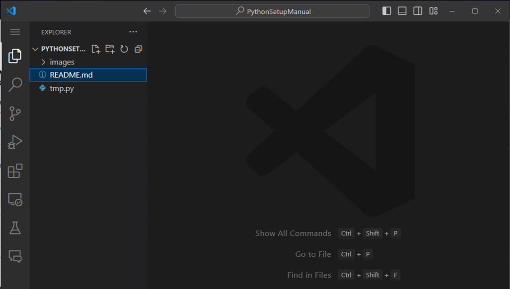

# GitManual
WindowsにGitをインストールしてVSCODEでgithubに資料やコードをCommit(アップロード）するまでのチュートリアル

## 本セクションの目的

githubに資料やコードをアップロード(コミット)しておいておくためには、ローカル(任意の手持ちのパソコン)からリモート(github)に変更という流れで作業をする必要がある。そのために必要なプログラムがGitであり、これをインストールすることで、ローカルの変更をリモートに反映させるなどの処理ができるようになる。本セクションでは、これらの処理を行えるようになるまでのセットアップおよび基本操作について解説する。この時、vscodeから直接コミットをはじめgit関連の処理が行えるため、vscodeとgitの組み合わせを前提とする。


# VSCODEのインストール

[VSCODEのインストール方法](https://github.com/SK-Lab-HU/PythonSetupManual)

# Gitのインストール

1. Gitダウンロードページにアクセスする。([Download git](https://git-scm.com/download/win))

2. <b>64-bit Git for Windows Setup</b>を選択する。


3. ダウンロードが完了したら、インストーラーを開く。この時、以下のような画面が出た場合は、Yesを選択する。


4. Installを押す。


5. このあとは、複数回様々なオプションについてダイアログが出てくるが、すべてポジティブなものを選択していく。最終的に以下の画面が表示されれば、Gitのインストールは終了。


6. コマンドプロンプトを開いて、以下コマンドを実行して、gitのバージョンが出てきたらインストールは成功している。

```Bash
git -v
```


# VSCODEでgitを使用する

上記のgitインストールが正常に完了している場合、VSCODEを開いた際にClone Git Repositoryという項目が増えている。


ここで、Cloneはリモート(github上)のリポジトリをローカル(自分のPC)に文字通りクローンするという意味である。

## Cloneの例

試しに、以下リポジトリのクローンを行う。

[Python設定マニュアルのリポジトリ](https://github.com/SK-Lab-HU/PythonSetupManual)

1. 上記のページの中で、緑色のCodeボタンを選択する。


2. HTTPSセクションを開いて、コピーアイコンをクリックまたは、URLを直接コピーする。

この場合なら、

https://github.com/SK-Lab-HU/PythonSetupManual.git

がclone用のURL。


3. VSCODEのスタートウィンドウで、Clone Git Repositoryを選択する。


4. VSCODEウィンドウ上部に以下のようなポップアップが出るので、2でコピーしたURLをペーストしてEnterを押す。


5. リポジトリをクローンする場所を聞かれるので選択する。この時、リポジトリはただのフォルダだと思うとわかりやすい。

例えばaという名前のリポジトリがありその中にpythonファイルや、textファイル、PPTXファイルなどが入っていて、それをローカルにクローンした場合は、aというフォルダが指定クローン先にコピーされるイメージ。

今回はDesktopを選択する。


クローンのディスティネーションを選択してクローンが完了すると、以下のようなポップアップが出るので、openを押す。


6. クローンが完了すると、リモート(github)のリポジトリをローカルにコピーできたことになる。

完了時には、以下のようにVSCODEでクローンしたフォルダが開かれた状態になっている。つまり、左側のファイルタブにあるtmp.pyなどのファイルは実際にクローン元のリポジトリに存在するファイルと同様のものである。



クローン処理自体はこれで完了である。

この時、クローンしたファイルをローカルで書き換えても、それをCommitしなければリモートとローカルのファイル内容は異なるものになる。
そのため、綺麗なコードをリモートに置いておき、いつでもそのコードをローカルにクローンして特定の処理を実行するというような使い方がなされることが多い。
また、クローンしたリポジトリに自分のGithubアカウントがコラボレータとして登録されていない場合は、どう頑張ってもリモートに変更を加える(commitする)ことはできない。

注意点として、今回クローンしたリポジトリは公開状態がパブリックであるため、アカウントなど特に気にすることなくクローンすることができた。これは、インターネット上の誰もが同様の操作を行える状況であることを意味する。実際には、公開状態はPrivateであることが多い。そのため、VSCODEに自分のgithubのアカウント情報を紐づける作業が必要になる。

よって次セクションで、VSCODEと自分のgithubアカウントの紐付け作業の方法を示す。

## VSCODEとGithubアカウントの紐付け

以下のPrivateリポジトリを用いて解説を行う。

[Privateなリポジトリの例(SK Lab HU)](https://github.com/SK-Lab-HU/StudySessions)

ここで、上記リポジトリについて、githubアカウントをVSCODEに紐づけたとしても、そのアカウントがリポジトリのメンバーまたはOrganizationのメンバーに入っていなければ、紐付けてもそのリポジトリをクローンすることはできない。

1. VSCODEのターミナルで以下のコマンドを実行する。
これは、自分のgithubアカウントのユーザー名を自分のPCに伝える作業である。

```bash
git config --global user.name "ikeda042"
```

(ダブルクオーテーションでユーザー名を囲む)

2. VSCODEのターミナルで以下のコマンドを実行する。
これは、自分のgithubアカウントのメールアドレスを自分のPCに伝える作業である。

```bash
git config --global user.email ikeda042@example.com
```

(ダブルクオーテーションは不要)

ターミナルでの実行例は以下のよう。


これらのコマンドを実行後、PrivateなリポジトリをクローンしようとするとVSCODEが勝手に認証プロセスを開始するので、ダイアログに従って認証プロセスを完了させれば紐付けは完了である。

# Gitの基本的な操作

gitコマンドを使用した操作は多岐に渡るが、ここでは日常的な操作でよく使うものだけをピックアップして解説する。

## リポジトリの作成

まずは、練習用にリポジトリの作成を行う。(これはgit操作とは無関係であるが、本項用にリポジトリ作成を行う。)

1. 初めにgithubのrepositoriesセクションに行き、緑色のボタン(New repository)を選択する。


2. リポジトリの名前(英数字のみ)およびその説明、公開状態を設定する。


3. Add a Readmeにチェックを入れる。


4. 最後にCreate repositoryを選択して作成を完了する。

完了後は以下のようなリポジトリトップに移動する。


## ファイルの変更のコミット

ファイルの変更をローカルからリモートにコミットする際の操作について。
上記で作成したリポジトリを例に取って解説する。このリポジトリは既にローカルにクローンされているものとする。

1. クローン後の初期画面は以下のようになっている。


2. Readmeファイルに変更を加えてみる。

Readmeファイルは特別なファイルで、リポジトリのトップページに優先的に表示されるマークダウンドキュメントである。このチュートリアルもReadmeに記述してあるため、リポジトリを開くとトップページにドキュメントが勝手に表示される。


今回は、TEST TITLEという見出しを追加した。追加部分の行の左端が緑になっているが、これはリモートと比べて新しい部分であることを示している。

ファイルに変更を加えると、gitがその変更を検知する。そのため、左のアイコンが縦に並んでいるうちの３つ目のアイコン(giticon)に青い文字で1と書かれていることがわかる。これは、このリポジトリにあるファイルのうち、一つのファイルに何かしらの変更があったことを示している。

このアイコンをクリックすると、以下のような変更差分確認画面になる。


今回は、README.mdというファイルに変更が入ったため、そのファイルが表示されている。

ここで、README.mdを選択すると、どこに差分が入ったかがハイライトされているため一目で変更の確認ができる。


